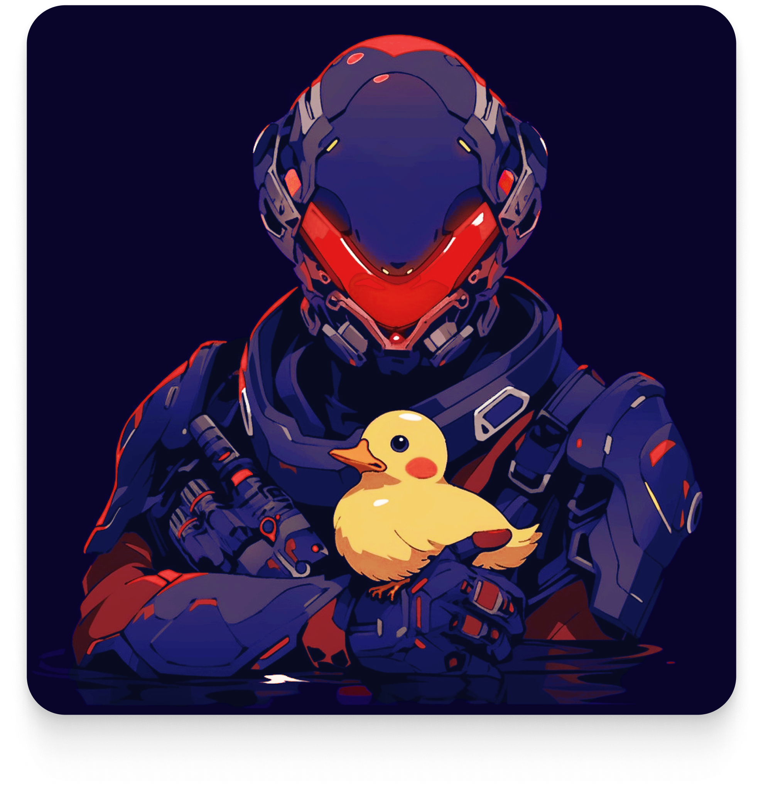

<p align="center">
  
</p>

# Save the Quacks

Fully on-chain replica of the famous Minesweeper game built on Starknet using the [Dojo engine](https://github.com/dojoengine/dojo).

### Entities
- ``

### Components

- `Square`: Can be a hint (number clues), a flag or a mine (or empty) will store square type and position (x, y)
- `Mine`: Store remaining mines to discover

### Systems 
- `Start` Generate a random grid based on 3 difficulty level (Beginner, Intermediate, Expert)
- `Hit`: Allow player to hit a square.
- `Put Flag`: Allow player to put a flag on a specific square.

## Running the game

Build the world :
```bash
sozo build

sozo migrate
```

## How to play ?

Choose a difficulty :

```bash
# beginner (8x8 with 10 mines)
sozo execute start -c 0

# intermediate (16x16 with 40 mines) 
sozo execute start -c 1

# expert (30x16 with 99 mines) 
sozo execute start -c 2
```

Grid :
```bash
# get Grid 
sozo component entity Grid 0x03ee9e18edc71a6df30ac3aca2e0b02a198fbce19b7480a63a0d71cbd76652e0

# get Grid schema
sozo component schema Grid

# you should get this return
> struct Grid {
>    grid_id: u32,
>    width: u16,
>    height: u16,
>   start_time: u64,
> }


```

Get Square :
```bash
# We are taking the square at position (1,0)
sozo component entity Square  0x03ee9e18edc71a6df30ac3aca2e0b02a198fbce19b7480a63a0d71cbd76652e0 1 0

# get Square schema
sozo component schema Square

# you should get this return
> struct Square {
>    x: u16,
>    y: u16,
>    hidden: bool,
>    mine: bool,
>    flag: bool,
> }

```

Add Flag on Square :
```bash
# We are adding a flag on the square at position (1,0)
sozo execute add_flag -c 1,0
```

Remove Flag on Square :
```bash
# We are removing a flag on the square at position (1,0)
sozo execute remove_flag -c 1,0
```

## Authors

- [@NotBearTeddy](https://twitter.com/NotBearTeddy)
